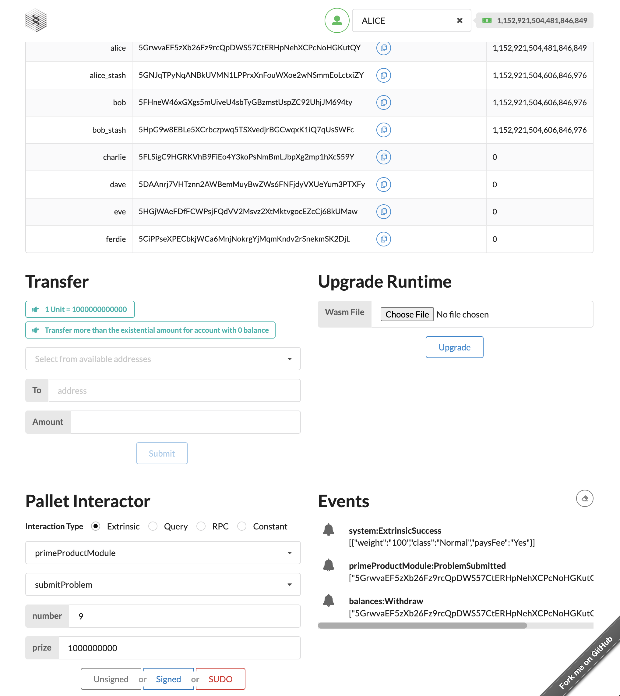
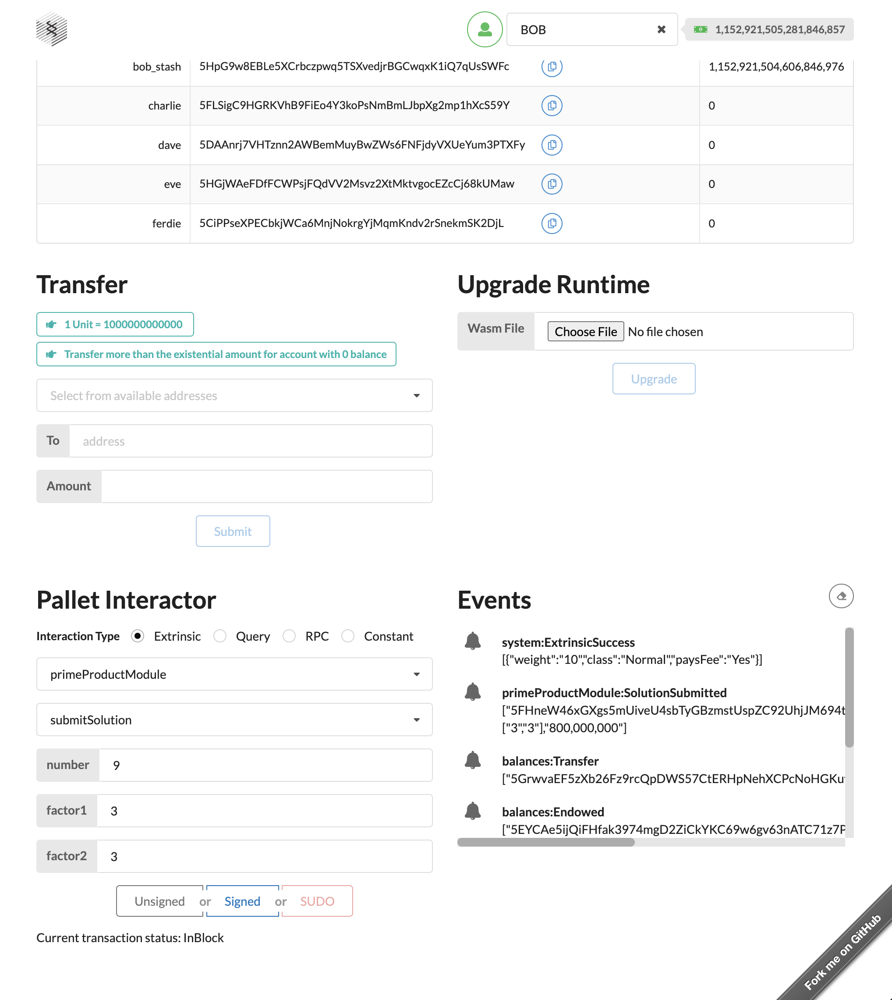
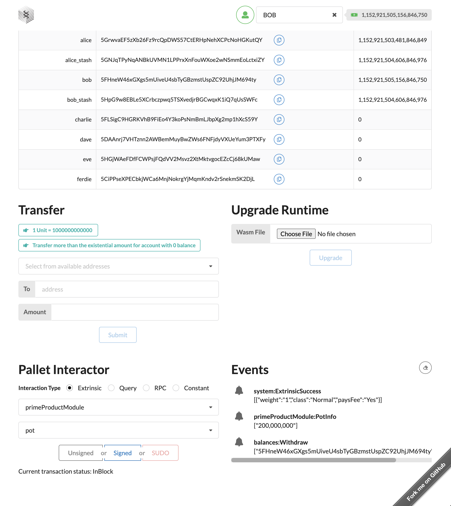

# Prime Product Pallet

Custom Substrate pallet which would help users to solve a particular problem.

## The problem

With the equation

N = a * b

for a given uint N, find a and b, knowing both a and b are prime integers

Example:

Problem: N = 6

Solution: a = 2, b = 3

- Any user can submit new problem and set a non-zero reward for a solution.

- Any user can submit solution candidate for yet unsolved problem, and if correct, receive 80% of the problem's reward.

- The rest 20% of the reward stays in pallet's "treasury pool".

The following data should be stored on-chain:

- unsolved and solved problems,
- correct solutions.

## Node Template

The source code of the pallet can be found [here](./pallets/prime-product/).

If you want to run the whole [Substrate](https://substrate.io/) node, you can use the following command:

```sh
# to build the node
cargo build --release
# to run it
./target/release/node-template --dev
```

If you want to learn more about it, you can read the the [node's README](./SUBSTRATE.md) or the [node's documentation](https://docs.substrate.io/).

## How to use it

You can use the [Substrate front-end template](https://github.com/substrate-developer-hub/substrate-front-end-template) to get started with the node and the pallet.

First, in this case, Alice submits a new problem for `N = 9` and offers a reward of `1_000_000_000`.



Then Bob submits a solution candidate for `N = 9` and, as it is correct, it gets the 80% of the reward of `800_000_000`. You can check it in the `events` table.



The 20% of each reward stays in the **treasury pool**, `200_000_000`.


